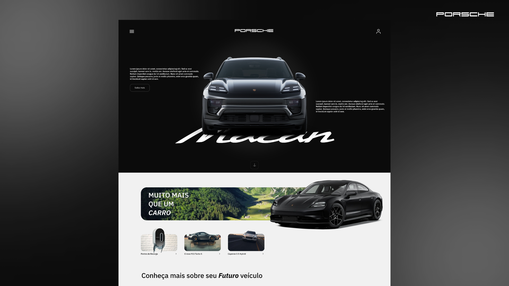
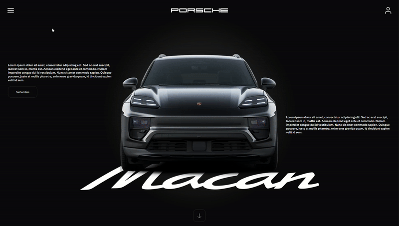
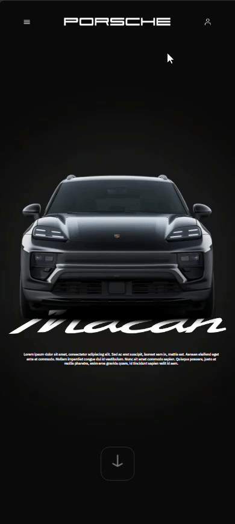
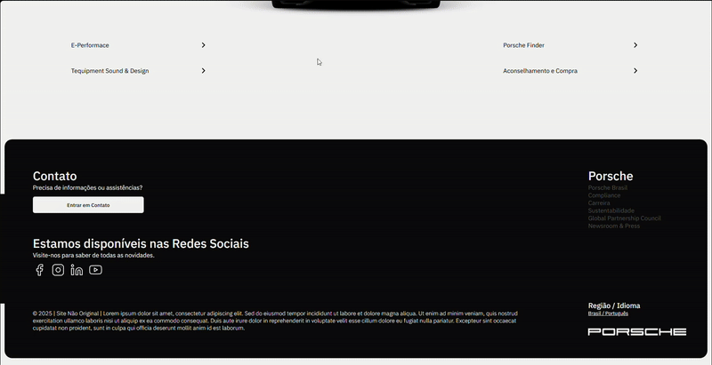
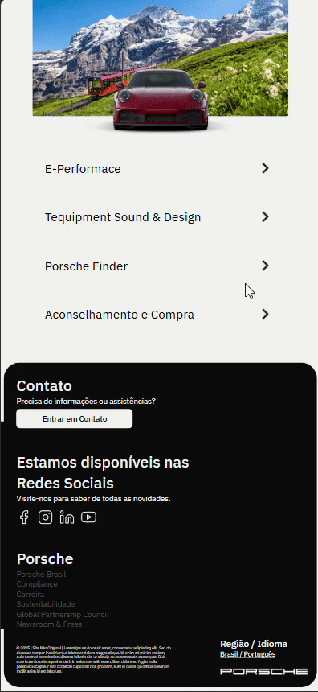

  
<h1><b>SITE NÃO OFICIAL PORSCHE</b></h1>

<h5>Esse site foi criado para <b>uso pessoal</b> e <b>mostrar o novo design desenvolvido</b></h5>
<h5>Para ver, vá: <a href="https://zzoendev.github.io/Porsche-New-Design/">https://zzoendev.github.io/Porsche-New-Design</a></h5>

<h1 align="center">Overview:</h1>
<h6 align="center">Home e Menu</h6>

  
  
  
  

<h6 align="center">Main page</h6>

  
  
  
  

<h6 align="center">Footer</h6>

  
  
  
  

<h4 align="center"> Desenvolvido por ZzoeNdev</h4>
